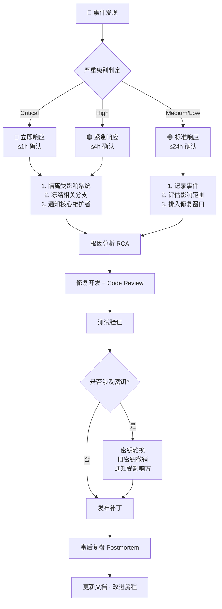

# FIBEMATE 应急响应流程

> 配套: SECURITY.md · VULNERABILITY-DISCLOSURE.md · RECOVERY_PLAN.md

## 响应流程图



## 角色与职责

| 角色 | 职责 | 当前负责人 |
|------|------|:---:|
| 安全响应协调员 | 接收报告、判定级别、协调修复 | @Lennonhaha |
| 代码维护者 | 修复漏洞、代码审查 | @Lennonhaha |
| 基础设施管理员 | 服务器隔离、配置修改 | @Lennonhaha |

> ⚠️ **Bus Factor = 1**：当前所有角色由同一人承担。开源后需要招募至少 1 名协作者分担响应职责。

## 事件分级与响应时间

| 级别 | 确认时限 | 修复时限 | 披露时限 | 示例 |
|:---:|:---:|:---:|:---:|------|
| 🔴 Critical | ≤1h | ≤14d | ≤60d | 私钥恢复、签名伪造、认证绕过 |
| 🟠 High | ≤4h | ≤30d | ≤90d | 侧信道泄露、降级攻击 |
| 🟡 Medium | ≤24h | 下一版本 | ≤90d | 特定条件绕过、WASM 崩溃 |
| 🟢 Low | ≤7d | 后续版本 | 通常不单独公告 | 非恒定时间比较、文档修正 |

## 关键操作清单

### 🔴 Critical 事件
- [ ] 确认事件真实性（要求 PoC）
- [ ] 评估影响范围（受影响的包/版本/用户）
- [ ] 在 GitHub Security Advisory 创建临时私有报告
- [ ] 冻结相关 git 分支
- [ ] 如果涉及 fibemate.net 服务器：停止受影响服务
- [ ] **如果涉及私钥泄露**：
  - [ ] 生成新密钥对
  - [ ] 撤销旧密钥（如在证书中）
  - [ ] 检查是否有利用旧密钥签名的恶意内容
  - [ ] 通知已知受影响方
- [ ] 开发修复（14 天内）
- [ ] 发布修复版本 + CVE 申请
- [ ] 事后复盘

### 🟠 High 事件
- [ ] 确认并分类
- [ ] 创建 GitHub Security Advisory
- [ ] 评估是否需要立即修补或可放入下一发布窗口
- [ ] 30 天内修复
- [ ] 公开披露

### 🟡 Medium / 🟢 Low 事件
- [ ] 记录到 GitHub Issue
- [ ] 排入正常发布周期
- [ ] 修复后关闭

## 通报模板

```
标题: [FIBEMATE Security Advisory] GHSA-xxxx-xxxx-xxxx

严重级别: Critical / High / Medium / Low
CVE: CVE-2026-xxxxx
影响版本: < vX.Y.Z
修复版本: vX.Y.Z+1

摘要:
[一句话描述漏洞]

影响:
[谁受影响、什么条件下触发、可能后果]

修复:
[简述修复方式]

致谢:
[报告者姓名/化名]

时间线:
- YYYY-MM-DD: 报告接收
- YYYY-MM-DD: 确认
- YYYY-MM-DD: 修复完成
- YYYY-MM-DD: 公告发布
```

## 依赖供应链事件特殊处理

如果事件涉及 **npm 依赖投毒/供应链攻击**（如恶意版本发布、依赖劫持）：

1. **立即**：锁定 `package-lock.json`，禁止自动更新
2. **评估**：检查 `npm audit` + Dependabot alerts 交叉验证
3. **隔离**：如果依赖已被安装，检查是否有异常网络请求或文件写入
4. **替换**：降级到已知安全版本或临时 fork 安全分支
5. **审计**：检查 `node_modules/` 中的变更（git diff）
6. **报告**：向 npm Security 团队报告 (`npm report`)

## 历史事件

| 日期 | 事件 | 级别 | 状态 |
|------|------|:---:|:---:|
| 2026-08-10 | fibemate.link SSL 证书过期 | Medium | ✅ 已修复 |
| 2026-07-25 | GitHub 2FA 未启用导致 CI 假性失败 | Low | ✅ 已修复 |

---

*更新: 2026-08-12 · 下次审查: 2026-11-12*
